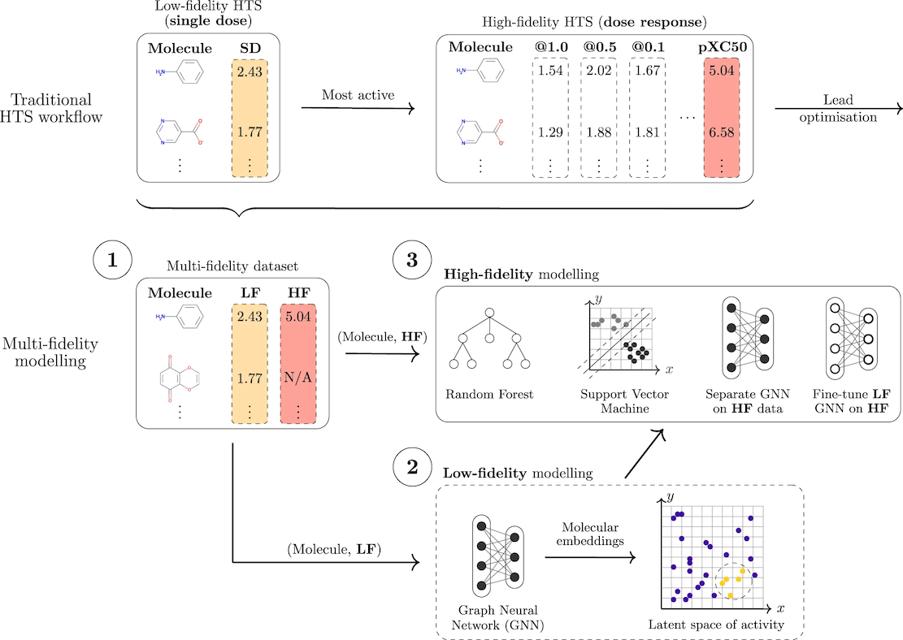

# Multi-fidelity GNNs for drug discovery

## Abstract
Scientific data generation requires a careful balance between accuracy, throughput, and cost. Correspondingly, multi-fidelity molecular information is frequently occurring, consisting of multiple experimental measurements of identical or correlated endpoints, often in the context of a large amount of lower fidelity, inexpensive measurements and relatively fewer, higher fidelity (and hence more costly) measurements.  Here, we investigate machine learning methods to integrate these data modalities and improve prediction of high-fidelity labels, exploiting the greater coverage and scale of low fidelity measurements. Compared to existing computational methods that rely on single-fidelity measurements, we show that multi-fidelity integration consistently and significantly improves the predictive performance on heterogeneous molecular learning tasks. We demonstrate this benefit on real-world bioactivity prediction tasks based on a newly-assembled collection of more than 40 high-throughput screening (HTS) datasets, totalling over 28 million unique molecule-protein interactions. In this process, we show that successful multi-fidelity integration as proposed here requires advances in graph and set representation learning. Practically, multi-fidelity modelling is immediately applicable to thousands of existing molecular data collections as well as future projects. We then discuss the effects of covering an orders-of-magnitude larger chemical space compared to traditional models on the selectiveness of the models, an important aspect when such models are used to search for prospective drug candidates.

## General
This repository contains the source code for all the machine learning models presented in the **Improving molecular property prediction with multi-fidelity graph representation learning on millions of experimental endpoints** paper, as well as instructions on how to run the models and collect metrics.

The public multi-fidelity datasets are now part of a collection named **MF-PCBA** (Multi-Fidelity PubChem BioAssay). The datasets are accessible through a separate repository: https://github.com/davidbuterez/mf-pcba/

To minimise possible points of failure, the data acquisition and modelling workflows are split into several steps.

Note that the training scripts were designed to be used without a package structure, which is still the approach taken by the notebooks that generate the `.sh` scripts below.

## Reproducibility
All the data splits for the non-proprietary data are available in the [MF-PCBA repository](https://github.com/davidbuterez/mf-pcba/). The training code sets a global seed using `pytorch_lightning.seed_everything(0)`, which covers PyTorch, NumPy and Python random number generators.

## Example/Demo
An example split DR dataset (AID 1445) is provided in the directory [example_DR_dataset_AID1445](https://github.com/davidbuterez/multi-fidelity-gnns-for-drug-discovery/tree/main/example_DR_dataset_AID1445), containing `train.csv`, `validate.csv`, and `test.csv` files (the same as the output of the MF-PCBA data acquisition workflow below). The provided example dataset also includes SD embeddings for each molecule (64 dimensions) from a separate SD model. SD embeddings can be added to the training files following the instructions below. Due to the large size of the SD datasets (typically more than 300,000 molecules), it is impractical to provide an example SD dataset in this repository (training also takes multiple hours/days). Such experiments can be performed by following the instructions under the **Workflows** section (subsection 2).

The following code can be used to train a base (non-augmented) DR model for the example dataset (replace the input/output directories):
```
python -m multi_fidelity_modelling.DR_modelling.deep_learning.train_dr --data-path /.../multi-fidelity-gnns-for-drug-discovery/example_DR_dataset_AID1445 --out-dir /.../out --target-label DR --node-latent-dim 50 --graph-latent-dim 64 --smiles-column neut-smiles --max-atomic-number 35 --readout global_add_pool --id-column CID --no-use-vgae --num-layers 2 --conv GCN --use-batch-norm --gnn-intermediate-dim 128 --name 1445 --task-type regression --no-use-cuda
```

Training a model with experimentally-determined SD labels:
```
python -m multi_fidelity_modelling.DR_modelling.deep_learning.train_dr --data-path /.../multi-fidelity-gnns-for-drug-discovery/example_DR_dataset_AID1445 --out-dir /.../out --target-label DR --node-latent-dim 50 --graph-latent-dim 64 --smiles-column neut-smiles --max-atomic-number 35 --readout global_add_pool --id-column CID --no-use-vgae --num-layers 2 --conv GCN --use-batch-norm --gnn-intermediate-dim 128 --name 1445 --task-type regression --no-use-cuda --lbl-or-emb lbl  --auxiliary-data-column-name SD  --auxiliary-dim 1
```

Training a model with separately-computed SD embeddings:
```
python -m multi_fidelity_modelling.DR_modelling.deep_learning.train_dr --data-path /.../multi-fidelity-gnns-for-drug-discovery/example_DR_dataset_AID1445 --out-dir /.../out --target-label DR --node-latent-dim 50 --graph-latent-dim 64 --smiles-column neut-smiles --max-atomic-number 35 --readout global_add_pool --id-column CID --no-use-vgae --num-layers 2 --conv GCN --use-batch-norm --gnn-intermediate-dim 128 --name 1445 --task-type regression --no-use-cuda --lbl-or-emb emb  --auxiliary-data-column-name Embeddings  --auxiliary-dim 64
```

The DR models above are quick enough to require around 1 second per epoch, and less than 1 minute overall training time for the entire training run on a modern laptop. These times are achieved without using a graphics processing unit (CUDA). CUDA is recommended for the larger SD datasets.

Please check the **Requirements/installation** section below for details regarding the software versions that were tested and compatible hardware.

## Workflows
### 0. Data acquisition
1. Download one dataset or a selection of datasets using the code and instructions from the MF-PCBA repository. For example, the following command downloads the AID 1445 dataset to a `save_dir` directory:

```
python pubchem_retrieve.py --AID "1445"
--list_of_sd_cols "Primary Inhibition" "Primary Inhibition Rep 2" "Primary Inhibition Rep 3" 
--list_of_dr_cols "IC50" --transform_dr "pXC50" --save_dir <save_dir>
```

2. The step above downloaded and filtered the data corresponding to AID 1445. To obtain train, validation, and test sets, the `split_DR_with_random_seeds.ipynb` notebook available in the MF-PCBA repository can be used. The same 5 random split seeds as used in the paper are provided in the MF-PCBA repository and are used by default. After this step, the DR data is split into train, validation, and test sets 5 different times, with the resulting `.csv` files being saved in different directories:

```
parent_dir/
├── 0/
│   ├── train.csv
│   ├── validate.csv
│   └── test.csv
├── 1/
│   ├── train.csv
│   ├── validate.csv
│   └── test.csv
| ...
└──
...
```

### 1. Training non-augmented ('base') models and models augmented with SD labels ('+ labels')
These models do not require a separate SD modelling phase and can be applied directly to the split DR data from MF-PCBA. DR model training is handled with the Python script `train_dr.py`. An example:

```
python -m multi_fidelity_modelling.DR_modelling.deep_learning.train_dr
--data-path <directory containing train/val/test files>
--out-dir <directory where checkpoints and metrics are saved>
--target-label DR --node-latent-dim 50 --graph-latent-dim 64 --smiles-column neut-smiles
--max-atomic-number 35 --readout global_add_pool --id-column CID --no-use-vgae --num-layers 2 --conv GCN 
--use-batch-norm --gnn-intermediate-dim 128 --name 1445 --task-type regression --no-use-cuda
```

The arguments specify a model with a node dimension of 50, a graph dimension of 64 (this is used only for neural readouts, i.e. `--readout linear`; otherwise, the graph dimension is the same as the node dimension, so 50 in this case. The model uses 2 GCN layers in a standard GNN architecture (`--no-use-vgae`, so not the guided VGAE), with an intermediate dimension in the graph layers of 128, and with batch normalisation between the graph layers. Furthermore, the command specifies a maximum atomic number of 35 for this dataset, as well as the fact that this is a regression task and that this model uses the CPU, not CUDA. Furthermore, the command specifies certain attributes specific to the dataset, such as the target label (column in the `.csv` file) to predict, in this case 'DR', the name of the SMILES column, in this case 'neut-smiles', and the name of the column containing each molecule's/compound's ID, in this case 'CID'.

The model above corresponds to a 'base' (non-augmented) model that does not use SD information in any way. To augment the model with such data, the following arguments must be added:

```
--lbl-or-emb lbl  --auxiliary-data-column-name SD  --auxiliary-dim 1 
```

In this case, we want to augment using labels, so the auxiliary dimension is 1. We also provide the name of the column containing the SD labels in the train/validation/test `.csv` files. The SD label is included by default in all DR files obtained from the MF-PCBA collection.

Using additional configurations is explored in the notebook `generate_DR_scripts.ipynb`, which can be used to generate all the required training commands/scripts easily. The notebook also covers finding the right maximum atomic number for each dataset.

### 2. Augmenting with SD embeddings
Augmenting with SD embeddings requires training a separate guided VGAE model exclusively on the entirety of the SD data, then extracting the corresponding embeddings.

#### a. Training an SD model
This task is handled with the Python script `train_sd.py`, which is very similar in usage to `train_dr.py`. An example:

```
python -m multi_fidelity_modelling.SD_modelling.train_sd
--data-path <directory containing train/val/test files>
--out-dir <directory where checkpoints and metrics are saved>
--sd-label SD --node-latent-dim 50 --graph-latent-dim 64 --gnn-intermediate-dim 512
--smiles-column neut-smiles --max-atomic-number 53 --readout linear --id-column CID
--monitor-loss-name train_total_loss --use-vgae --num-layers 2 --conv GCN --no-use-batch-norm
--num-epochs 200 --name 1445 --use-cuda
```

By default, CUDA is used due to the large number of SD training points and the readout is fixed to 'linear' (the MLP neural readout) as it is the only one that is effective in this learning task.

Using additional configurations is explored in the notebook `generate_SD_scripts.ipynb`, which can be used to generate all the required training commands/scripts easily. The notebook also covers finding the right maximum atomic number for each dataset.

#### b. Extracting the molecular/graph embeddings and the predicted SD values
Once the model has finished training, it can be loaded up from the latest checkpoint to produce graph embeddings for all the SD molecules in the dataset. The predicted SD values can also be extracted, which is useful for the 'DR-not-in-SD' workflows.

This task is covered by the `generate_sd_embs_preds.py` script, which has a very similar interface to `train_sd.py`, only additionally requiring a checkpoint path. An example:

```
python -m multi_fidelity_modelling.SD_modelling.generate_sd_embs_preds
--data-path <directory containing train/val/test files>
--out-dir <directory where checkpoints and metrics are saved>
--ckpt-path <path to .ckpt file saved by PyTorch Lightning>
--sd-label SD --node-latent-dim 50 --graph-latent-dim 64 --gnn-intermediate-dim 512
--smiles-column neut-smiles --max-atomic-number 53 --readout linear --id-column CID
--monitor-loss-name train_total_loss --use-vgae --num-layers 2 --conv GCN --no-use-batch-norm
--name 1445 --use-cuda 
```

Note that the same settings that were used in `train_sd.py` must be used here as well. The above script saves three files in the `out-dir`:

- `SD_graph_embeddings.npy` -- the graph embeddings for each SD molecule in a NumPy array
- `SD_preds.npy` -- the predicted SD activity values for each SD molecule in a NumPy array
- `SD_true.npy` -- the actual/ground truth SD activity values (same as in the original SD `.csv` file) in a NumPy array

#### c. Joining the embeddings/predicted SD values to the `.csv` files
This step is achieved by following the instructions in the `join_embeddings_with_dataset.ipynb` notebook. If the SD and DR files are originally available in the same PubChem bioassay (e.g. AID 1445), then the only required files in the notebook are (1) the SD `.csv` file (as downloaded with the MF-PCBA code) and (2) the corresponding `SD_graph_embeddings.npy` file.

If the SD and DR files were originally available in different bioassays, then the notebook also requires the original, unsplit DR `.csv` file (as downloaded with the MF-PCBA code).

After joining, a new DR `.csv` can be saved to disk, containing the SD embeddings in a column named 'Embeddings'.

#### d. Split the resulting DR file into train/validation/test sets
The new DR file (containing the embeddings) must be split into train/validation/test sets, as before. This is done exactly as before, but providing the new DR file instead.

#### e. Training a DR model augmented with SD embeddings
With the appropriate data (`.csv` files containing the embeddings), the training command for `train_dr.py` requires minimal changes:

```
--lbl-or-emb emb  --auxiliary-data-column-name Embeddings  --auxiliary-dim 64
```

Since the graph embedding dimension was set to 64 in the SD modelling step (`--graph-latent-dim 64`).

Examples of such training commands can be generated with the notebook `generate_DR_scripts.ipynb`.

### 3. Shallow (RF/SVM) models
The training scripts for RF and SVM perform hyperparameter optimisation by default. The scripts also assume that the provided train/validation/test `.csv` files already include the embeddings.

The RF models can be trained using `rf.py`:

```
python -m multi_fidelity_modelling.DR_modelling.shallow.rf
--path <directory containing train/val/test files>
--save_path <directory where the models and metrics are saved>
--smiles_column {smiles_column} --DR_label {dr_label} --SD_label {sd_label} --SD_EMBS_label {sd_embs_label}
--type {type}
```

and the SVM models using the same interface and the script `svm.py`:

```
python -m multi_fidelity_modelling.DR_modelling.shallow.svm
--path <directory containing train/val/test files>
--save_path <directory where the models and metrics are saved>
--smiles_column {smiles_column} --DR_label {dr_label} --SD_label {sd_label} --SD_EMBS_label {sd_embs_label}
--type {type}
```

Here, `type` refers to a classification or regression model (these are valid options for the argument), and `smiles_column`, `DR_label`, `SD_label`, `SD_EMBS_label` are the corresponding labels in the `.csv` files.

As with the other models, a helper notebook to generate training commands/scripts is provided (`generate_shallow_scripts.ipynb`).

## Requirements/installation
The main dependencies are PyTorch, PyTorch Geometric, PyTorch Lightning, and RDKit. Certain steps also require pandas, numpy, scipy, sklearn, and tqdm.

The latest releases of the above work with our code (tested up to PyTorch 1.12). For example:

1. Install a CUDA-enabled version of PyTorch
 ```
conda install pytorch==1.12.1 torchvision==0.13.1 torchaudio==0.12.1 cudatoolkit=11.6 -c pytorch -c conda-forge
```
2. Install PyTorch Geometric
```
conda install pyg -c pyg
```
3. Install PyTorch Lightning
```
pip install pytorch-lightning
```
4. Install RDKit
```
conda install rdkit -c conda-forge
```

Note that different versions of RDKit might produce slightly different results when filtering the datasets.

An example conda environment file is provided in this repository (`env.yml`).

### Tested versions
The code was primarily developed and tested on a computer running Ubuntu 21.10, PyTorch 1.10.1 (with CUDA 11.3), PyTorch Geometric 2.0.3, PyTorch Lightning 1.5.7, and RDKit 2021.09.3.

The code was also tested on a different Linux platform with PyTorch 1.11.0 (with CUDA 11.3), PyTorch Geometric 2.1.0, PyTorch Lightning 1.6.0, and RDKit 2021.09.4.

We have also successfully run the code on macOS Ventura (13.0.1), a nightly version of PyTorch (1.14.0.dev20221026), PyTorch Geometric 2.1.0 (**installed from source, not from pip or conda**), PyTorch Lightning 1.7.7, and RDKit 2022.09.1.

### Tested hardware
The code was tested on an NVIDIA GeForce RTX 3090 24GB GPU (running under Ubuntu 21.10, with driver version 510.73.05), NVIDIA Tesla V100 16GB and 32GB GPUs, and an Apple M1 chip (CPU only).
